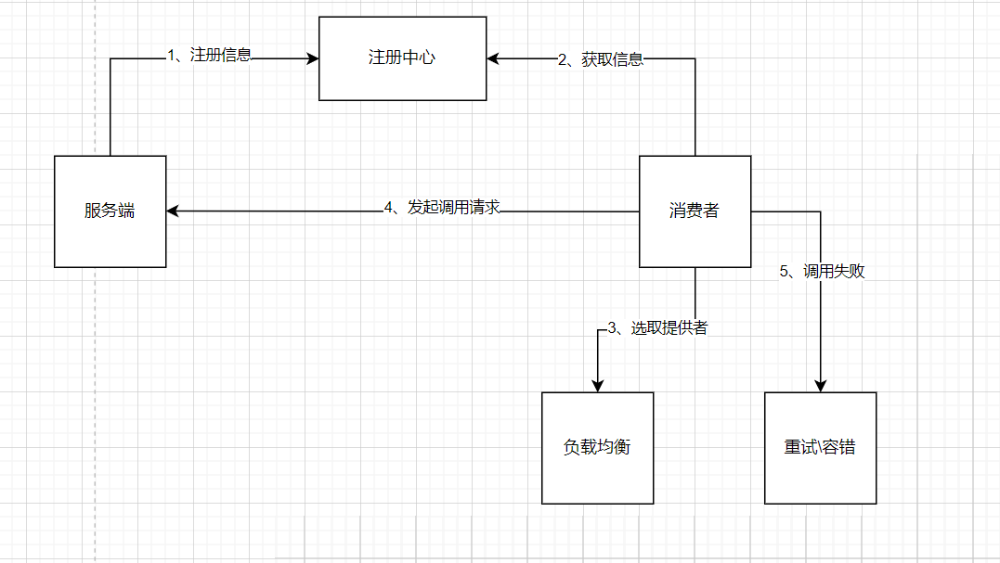

# dixon_RPC框架

## 项目介绍

基于 Java + Etcd + Vert.x 的高性能 RPC 框架，可以学习并实践基于 Vert.x 的网络服务器、序列化器、基于 Etcd 的注册中心、反射、动态代理、自定义网络协议、多种设计模式（单例 / 工厂 / 装饰者等）、负载均衡器设计、重试和容错机制、Spring Boot Starter 注解驱动开发等，大幅提升架构设计能力。

## 技术选型

### 后端

后端技术以 Java 为主，但所有的思想和设计都是可以复用到其他语言的，代码不同罢了。

- ⭐️ Vert.x 框架
- ⭐️ Etcd 云原生存储中间件（jetcd 客户端）
- ⭐️ SPI 机制
- ⭐️ 多种序列化器
    - JSON 序列化
    - Kryo 序列化
    - Hessian 序列化
- ⭐️ 多种设计模式
    - 双检锁单例模式
    - 工厂模式
    - 代理模式
    - 装饰者模式
- ⭐️ Spring Boot Starter 开发
- 反射和注解驱动
- JUnit 单元测试
- Logback 日志库
- Hutool、Lombok 工具库

## 源码目录

- dixon-rpc-V2：dixon RPC 框架核心代码
- dixon-rpc-easy：dixon RPC 框架简易版
- example-common：示例代码公用模块
- example-consumer：示例服务消费者
- example-provider：示例服务提供者
- example-springboot-consumer：示例服务消费者（Spring Boot 框架）
- example-springboot-provider：示例服务提供者（Spring Boot 框架）
- dixon-rpc-spring-boot-starter：注解驱动的 RPC 框架，可在 Spring Boot 项目中快速使用

# 第一版：RPC 框架简易版

1. RPC 基本概念和作用
2. 涵盖了基本设计 扩展设计 项目初始化 web 服务器 本地服务注册器 序列化器 请求处理器 消费者代理 测试验证

# 第二版：RPC 框架扩展版
## 功能&设计🚀
___
# 功能
* 简单易学的代码和框架，在代码中含有大量注解
* 基于`Vert.x`实现长连接通信，包括心跳检测、解决粘包半包等
* 基于`Etcd`实现分布式服务注册与发现
* 实现了轮询、随机、加权随机等负载均衡算法
* 实现了同步调用、异步调用多种调用方式
* 支持`jdk`的动态代理方式 
* 支持`fastJson`、`hessian`、`kryo`、`jdk`的序列化方式
* 支持简易扩展，泛化调用等功能

## 设计
`dixon_rpc`框架调用流程：

1. 服务提供者启动服务
2. 服务消费者调用服务
3. 服务提供者处理请求
4. 服务提供者响应请求
5. 服务消费端重试和容错